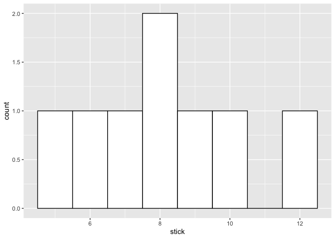
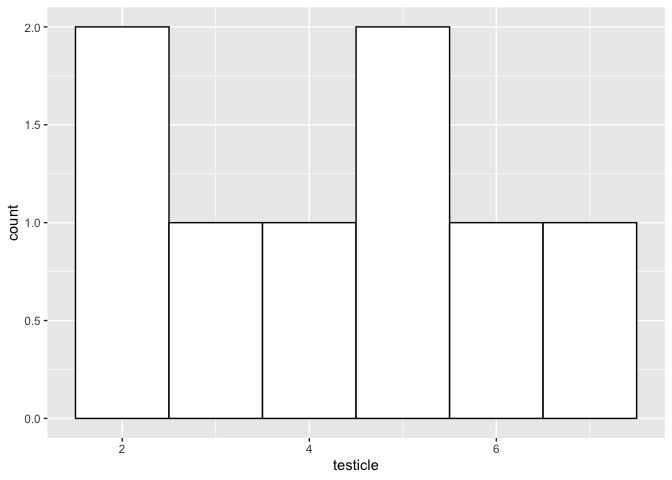
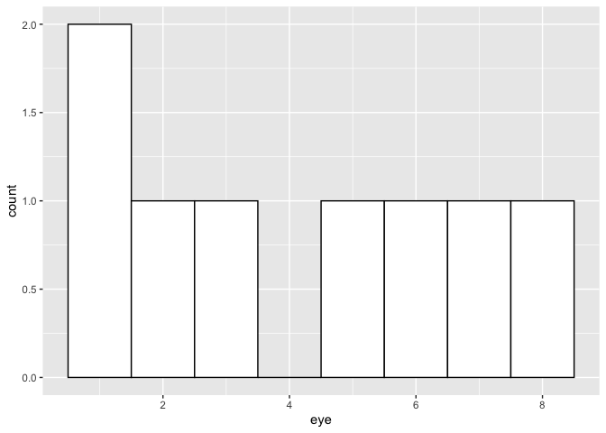
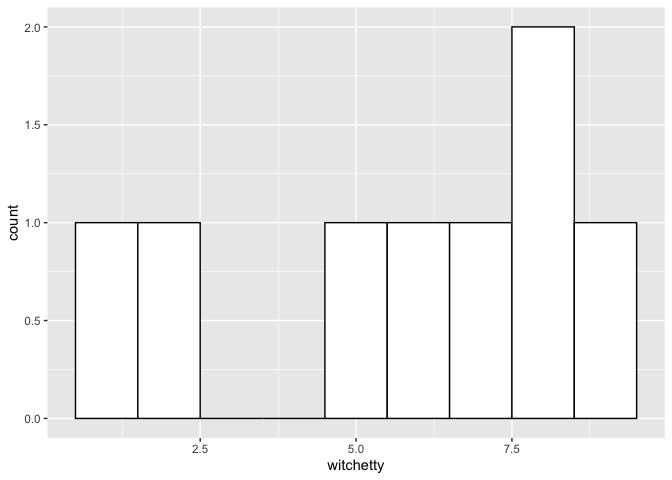
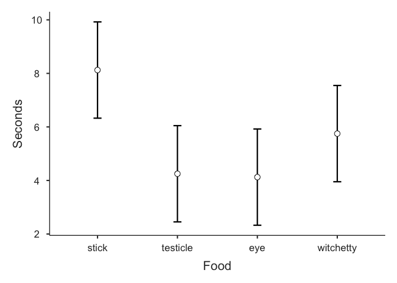

RMANOVA
=======

This R markdown document provides an example of performing a repeated
measures ANOVA using the jmv::anovaRM() function in the jmv (Jamovi)
package.

Package management in R
-----------------------

``` r
# keep a list of the packages used in this script
packages <- c("tidyverse","rio","jmv")
```

This next code block has eval=FALSE because you don’t want to run it
when knitting the file. Installing packages when knitting an R notebook
can be problematic.

``` r
# check each of the packages in the list and install them if they're not installed already
for (i in packages){
  if(! i %in% installed.packages()){
    install.packages(i,dependencies = TRUE)
  }
  # show each package that is checked
  print(i)
}
```

``` r
# load each package into memory so it can be used in the script
for (i in packages){
  library(i,character.only=TRUE)
  # show each package that is loaded
  print(i)
}
```

    ## Warning: package 'tidyverse' was built under R version 4.0.2

    ## ── Attaching packages ────────────────────────────────────── tidyverse 1.3.0 ──

    ## ✓ ggplot2 3.3.2     ✓ purrr   0.3.4
    ## ✓ tibble  3.0.1     ✓ dplyr   1.0.0
    ## ✓ tidyr   1.1.0     ✓ stringr 1.4.0
    ## ✓ readr   1.3.1     ✓ forcats 0.5.0

    ## Warning: package 'ggplot2' was built under R version 4.0.2

    ## ── Conflicts ───────────────────────────────────────── tidyverse_conflicts() ──
    ## x dplyr::filter() masks stats::filter()
    ## x dplyr::lag()    masks stats::lag()

    ## [1] "tidyverse"
    ## [1] "rio"

    ## Warning: package 'jmv' was built under R version 4.0.2

    ## [1] "jmv"

RMANOVA is a linear model
-------------------------

The RMANOVA is a type of linear model. However the RMANOVA is a
simplified for with additional constraints which allows us to analyze
data which violate the independence of observations assumption which is
required for the linear models we have used to this point. A nice
explanation is provided in Field chapter 15.4.

Open data file
--------------

The rio package works for importing several different types of data
files. We’re going to use it in this class. There are other packages
which can be used to open datasets in R. You can see several options by
clicking on the Import Dataset menu under the Environment tab in
RStudio. (For a csv file like we have this week we’d use either From
Text(base) or From Text (readr). Try it out to see the menu dialog.)

``` r
# Using the file.choose() command allows you to select a file to import from another folder.
#dataset <- rio::import(file.choose())
# This command will allow us to import a file included in our project folder.
dataset <- rio::import("Bushtucker.sav")
```

Get R code from Jamovi output
-----------------------------

You can get the R code for most of the analyses you do in Jamovi.

1.  Click on the three vertical dots at the top right of the Jamovi
    window.
2.  Click on the Syndax mode check box at the bottom of the Results
    section.
3.  Close the Settings window by clicking on the Hide Settings arrow at
    the top right of the settings menu.
4.  you should now see the R code for each of the analyses you just ran.

#### Visualization with ggplot

``` r
# plots for outcome split by groups
ggplot(dataset, aes(x = stick))+
  geom_histogram(binwidth = 1, color = "black", fill = "white")
```



``` r
ggplot(dataset, aes(x = testicle))+
  geom_histogram(binwidth = 1, color = "black", fill = "white")
```



``` r
ggplot(dataset, aes(x = eye))+
  geom_histogram(binwidth = 1, color = "black", fill = "white")
```



``` r
ggplot(dataset, aes(x = witchetty))+
  geom_histogram(binwidth = 1, color = "black", fill = "white")
```



RMANOVA in jmv package
----------------------

``` r
output = jmv::anovaRM(
    data = dataset,
    rm = list(
        list(
            label="Food",
            levels=c(
                "stick",
                "testicle",
                "eye",
                "witchetty"))),
    rmCells = list(
        list(
            measure="stick",
            cell="stick"),
        list(
            measure="testicle",
            cell="testicle"),
        list(
            measure="eye",
            cell="eye"),
        list(
            measure="witchetty",
            cell="witchetty")),
    effectSize = c("ges", "eta", "partEta"),
    depLabel = "Seconds",
    rmTerms = ~ Food,
    spherTests = TRUE,
    spherCorr = c("none", "GG", "HF"),
    postHoc = list(
        "Food"),
    postHocCorr = c(
        "bonf",
        "none",
        "tukey",
        "scheffe",
        "holm"),
    emMeans = ~ Food,
    emmTables = TRUE)
```

    ## Warning: attributes are not identical across measure variables; they will be
    ## dropped

``` r
output
```

    ## 
    ##  REPEATED MEASURES ANOVA
    ## 
    ##  Within Subjects Effects                                                                                                                             
    ##  ─────────────────────────────────────────────────────────────────────────────────────────────────────────────────────────────────────────────────── 
    ##                Sphericity Correction    Sum of Squares    df           Mean Square    F           p            η²-G         η²           η²-p        
    ##  ─────────────────────────────────────────────────────────────────────────────────────────────────────────────────────────────────────────────────── 
    ##    Food        None                           83.12500            3      27.708333    3.793806    0.0255703    0.3274249    0.3274249    0.3514799   
    ##                Greenhouse-Geisser             83.12500     1.598537       52.00068    3.793806    0.0625841    0.3274249    0.3274249    0.3514799   
    ##                Huynh-Feldt                    83.12500     1.997291       41.61888    3.793806    0.0483306    0.3274249    0.3274249    0.3514799   
    ##                                                                                                                                                      
    ##    Residual    None                          153.37500           21       7.303571                                                                   
    ##                Greenhouse-Geisser            153.37500    11.189757       13.70673                                                                   
    ##                Huynh-Feldt                   153.37500    13.981036       10.97022                                                                   
    ##  ─────────────────────────────────────────────────────────────────────────────────────────────────────────────────────────────────────────────────── 
    ##    Note. Type 3 Sums of Squares
    ## 
    ## 
    ##  Between Subjects Effects                                                                                     
    ##  ──────────────────────────────────────────────────────────────────────────────────────────────────────────── 
    ##                Sum of Squares    df    Mean Square    F    p            η²-G         η²           η²-p        
    ##  ──────────────────────────────────────────────────────────────────────────────────────────────────────────── 
    ##    Residual          17.37500     7       2.482143                                                            
    ##  ──────────────────────────────────────────────────────────────────────────────────────────────────────────── 
    ##    Note. Type 3 Sums of Squares
    ## 
    ## 
    ##  ASSUMPTIONS
    ## 
    ##  Tests of Sphericity                                                           
    ##  ───────────────────────────────────────────────────────────────────────────── 
    ##            Mauchly's W    p            Greenhouse-Geisser ε    Huynh-Feldt ε   
    ##  ───────────────────────────────────────────────────────────────────────────── 
    ##    Food      0.1362480    0.0468458               0.5328456        0.6657636   
    ##  ───────────────────────────────────────────────────────────────────────────── 
    ## 
    ## 
    ##  POST HOC TESTS
    ## 
    ##  Post Hoc Comparisons - Food                                                                                                                                  
    ##  ──────────────────────────────────────────────────────────────────────────────────────────────────────────────────────────────────────────────────────────── 
    ##    Food             Food         Mean Difference    SE          df          t              p            p-tukey      p-scheffe    p-bonferroni    p-holm      
    ##  ──────────────────────────────────────────────────────────────────────────────────────────────────────────────────────────────────────────────────────────── 
    ##    stick       -    testicle           3.8750000    1.351256    21.00000     2.86770228    0.0092136    0.0422912    0.0688661       0.0552818    0.0460681   
    ##                -    eye                4.0000000    1.351256    21.00000     2.96020881    0.0074701    0.0347801    0.0578305       0.0448205    0.0448205   
    ##                -    witchetty          2.3750000    1.351256    21.00000     1.75762398    0.0933811    0.3206962    0.3996166       0.5602868    0.3735245   
    ##    testicle    -    eye                0.1250000    1.351256    21.00000     0.09250653    0.9271724    0.9997067    0.9997827       1.0000000    0.9271724   
    ##                -    witchetty         -1.5000000    1.351256    21.00000    -1.11007830    0.2795153    0.6874563    0.7469435       1.0000000    0.7275647   
    ##    eye         -    witchetty         -1.6250000    1.351256    21.00000    -1.20258483    0.2425216    0.6320079    0.6982714       1.0000000    0.7275647   
    ##  ──────────────────────────────────────────────────────────────────────────────────────────────────────────────────────────────────────────────────────────── 
    ## 
    ## 
    ##  ESTIMATED MARGINAL MEANS
    ## 
    ##  FOOD
    ## 
    ##  Estimated Marginal Means - Food                                
    ##  ────────────────────────────────────────────────────────────── 
    ##    Food         Mean        SE           Lower       Upper      
    ##  ────────────────────────────────────────────────────────────── 
    ##    stick        8.125000    0.8730846    6.327076    9.922924   
    ##    testicle     4.250000    0.8730846    2.452076    6.047924   
    ##    eye          4.125000    0.8730846    2.327076    5.922924   
    ##    witchetty    5.750000    0.8730846    3.952076    7.547924   
    ##  ──────────────────────────────────────────────────────────────



Calculate omega squared
-----------------------

Field prefers to use omega squared for the effect size. He shows how to
calculate it using the information from the RMANOVA tables in section
15.11

``` r
omegaSquare = (((4-1)/(8*4))*(27.71 - 7.3))/(7.3 + ((2.48 - 7.3)/4) + (((4-1)/(8*4))*(27.71 - 7.3)))
omegaSquare
```

    ## [1] 0.2389277
